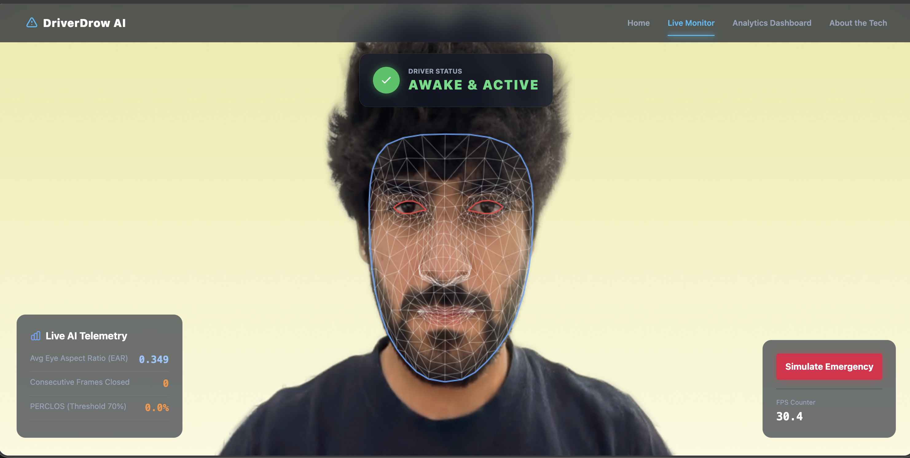
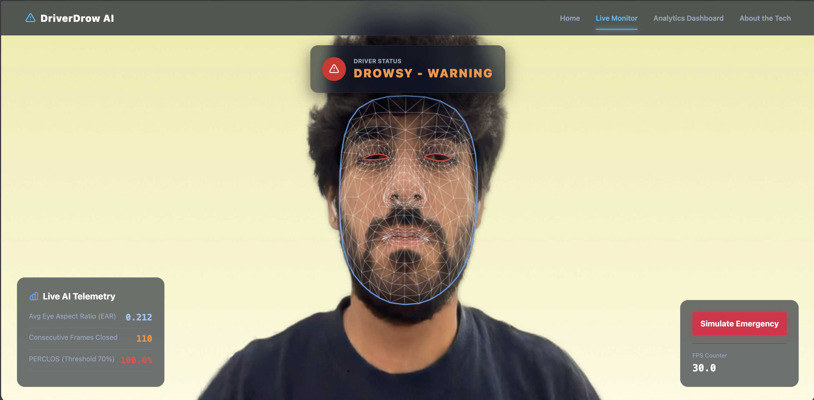
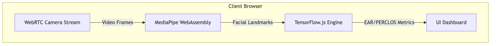
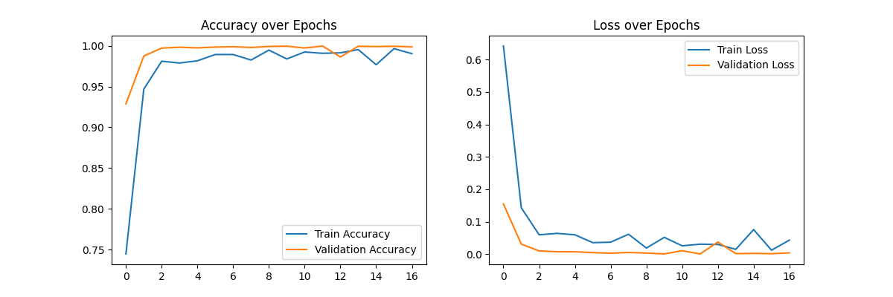
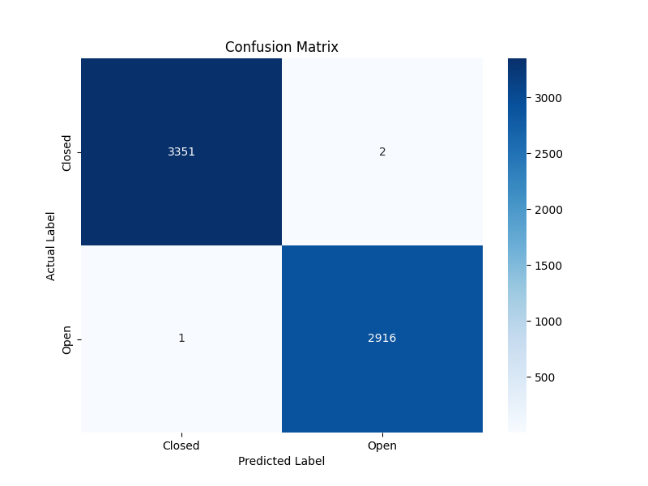
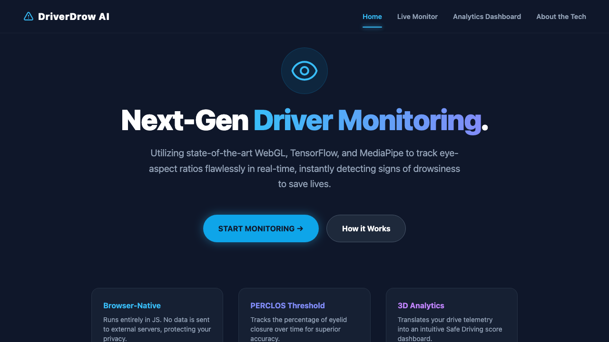

# DriveGuard: AI-Based Driver Drowsiness Detection System

[](LICENSE)
[]()
[]()
[]()
[-purple.svg)]()

## Overview
**DriveGuard** is an intelligent, privacy-preserving web application designed to prevent vehicular collisions caused by driver fatigue and microsleep episodes. Running entirely client-side in the web browser without any remote backend dependencies, DriveGuard leverages hardware-accelerated computer vision via **TensorFlow.js** and **MediaPipe Face Mesh (468 3D landmarks)** to track driver alertness in real-time.

---

## 📸 Real-Time System in Action

DriveGuard monitors live video feeds directly in the browser, extracting facial landmarks to calculate real-time Eye Aspect Ratio (EAR) and PERCLOS rolling fatigue metrics.

| 🟢 Awake & Active State | 🔴 Drowsiness Alert State |
| :---: | :---: |
|  |  |
| *Normal driving state: High EAR (~0.32), 0 consecutive closed frames, green status HUD indicator.* | *Fatigue event: Closed eyelids, low EAR (<0.25), elevated PERCLOS >70%, audible alarm & red pulsing HUD.* |

---

## Key Features
- ⚡ **Real-Time Zero-Latency Inference:** Operates smoothly at 30–60 FPS with latency under 35ms directly in the browser via WebGL.
- 🛡️ **100% Privacy-Preserving:** No video or image data is ever transmitted to an external server. All computation executes locally on the user's device.
- 👁️ **Hybrid Alertness Pipeline:** Combines geometric 3D facial landmark tracking (Eye Aspect Ratio & PERCLOS temporal rolling window) with a custom deep learning Convolutional Neural Network (CNN).
- 🔊 **Instant Multi-Sensory Alerts:** Dual audio-visual feedback featuring dynamic color-coded HUD states and custom synthesized audio alerts using the Web Audio API.
- 📊 **Comprehensive Analytics Dashboard:** Aggregates driving session telemetry, fatigue scores, and safety habits with an interactive 3D WebGL visualization.

---

## System Architecture
The application bridges the gap between deep learning models and client-side execution for zero-latency inference.


*(See [`imgg/dfd.png`](imgg/dfd.png), [`imgg/state.png`](imgg/state.png), and [`imgg/use_case.png`](imgg/use_case.png) for complete architectural workflows).*

---

## Deep Learning & Model Accuracy
We utilized the Kaggle **Driver Drowsiness Dataset (DDD)**, applying extensive data augmentation (rotation, zooming, horizontal flip, brightness scaling) to train a robust Convolutional Neural Network (CNN).

### CNN Model Performance
- **Training Accuracy:** ~99.97%
- **Testing (Validation) Accuracy:** ~99.86%
- **Quantization:** Reduced from 4.7 MB (FP32) to an INT8 quantized footprint of **1.17 MB** for ultra-fast browser loading.

| Training & Validation Loss/Accuracy | Confusion Matrix |
| :---: | :---: |
|  |  |

---

## Core Detection Algorithms

### 1. Eye Aspect Ratio (EAR)
EAR calculates the ratio between the vertical distances of the eyelids and the horizontal width of the eye using 6 key landmark coordinates per eye from MediaPipe's 468 3D mesh:

$$\text{EAR} = \frac{\|p_2 - p_6\| + \|p_3 - p_5\|}{2 \cdot \|p_1 - p_4\|}$$

- **Threshold:** If $\text{EAR} < 0.25$, the eye is classified as **Closed** for that frame.

### 2. PERCLOS (Percentage of Eye Closure)
To differentiate natural blinks (100–300ms) from microsleep and drowsiness, DriveGuard computes the proportion of closed eye frames over a 30-frame sliding window:

$$\text{PERCLOS} = \left( \frac{\sum_{i=1}^{N} \mathbb{I}(\text{EAR}_i < \text{Threshold})}{N} \right) \times 100\%$$

- **Normal Blinking:** PERCLOS $< 50\%$
- **Drowsiness Warning:** PERCLOS $\ge 70\%$
- **Critical Fatigue Alarm:** Continuous eye closure exceeding 60 consecutive frames (~2.0 seconds).

---

## Web Application Interface



The web dashboard is built with modern HTML5, Tailwind CSS, WebGL (Three.js), and TensorFlow.js. It features three interconnected views:
1. **Home / Launchpad:** System overview and quick session initialization.
2. **Live Monitor:** Full-screen camera stream with landmark mesh overlays, real-time EAR telemetry, and emergency simulation controls.
3. **Analytics Dashboard:** Safe driving score, weekly drive metrics, historical fatigue patterns, and AI rest recommendations.
4. **About the Tech:** Interactive algorithm sandbox with live EAR simulators, PERCLOS frame inspectors, and neural network pipeline walkthroughs.

---

## Local Development & Setup

### Prerequisites
- Modern web browser with WebGL & WebRTC support (Google Chrome, Microsoft Edge, Safari, Firefox).
- Python 3.x (or any local static file server).

### Running the App
1. Clone the repository:
   ```bash
   git clone https://github.com/AnirudhChhabra54/DriveGuard.git
   cd DriveGuard
   ```
2. Navigate to the web application directory:
   ```bash
   cd webapp
   ```
3. Start a local HTTP server:
   ```bash
   python3 -m http.server 8080
   ```
4. Open your browser and navigate to:
   ```
   http://localhost:8080
   ```
5. Allow camera permissions when prompted to enable real-time detection.

---

## License
This project is licensed under the MIT License - see the [LICENSE](LICENSE) file for details.
